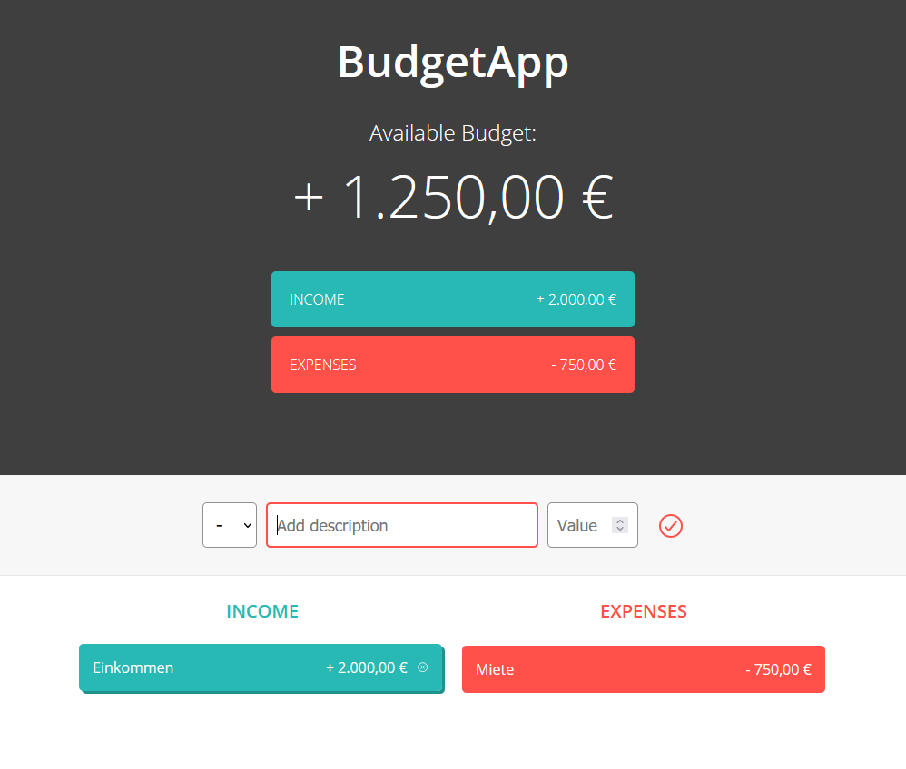

# Budget App

## Table of contents

- [The challenge](#the-challenge)
- [Screenshot](#screenshot)
- [Links](#links)
- [Built with](#built-with)

## The challenge

Users should be able to:

- View the optimal layout for the app depending on their device's screen size
- See hover/active states for all interactive elements on the page
- Calculate the correct budget and total income/expense based on the input of multiple income and expenses values

## Screenshot

## Links

- [GitHub ](https://github.com/hupetim/budget-app)
- [Live Site](https://hupetim-budget-app.netlify.app/)

## Built with

- HTML5
- CSS
- Flexbox
- Plain JavaScript
